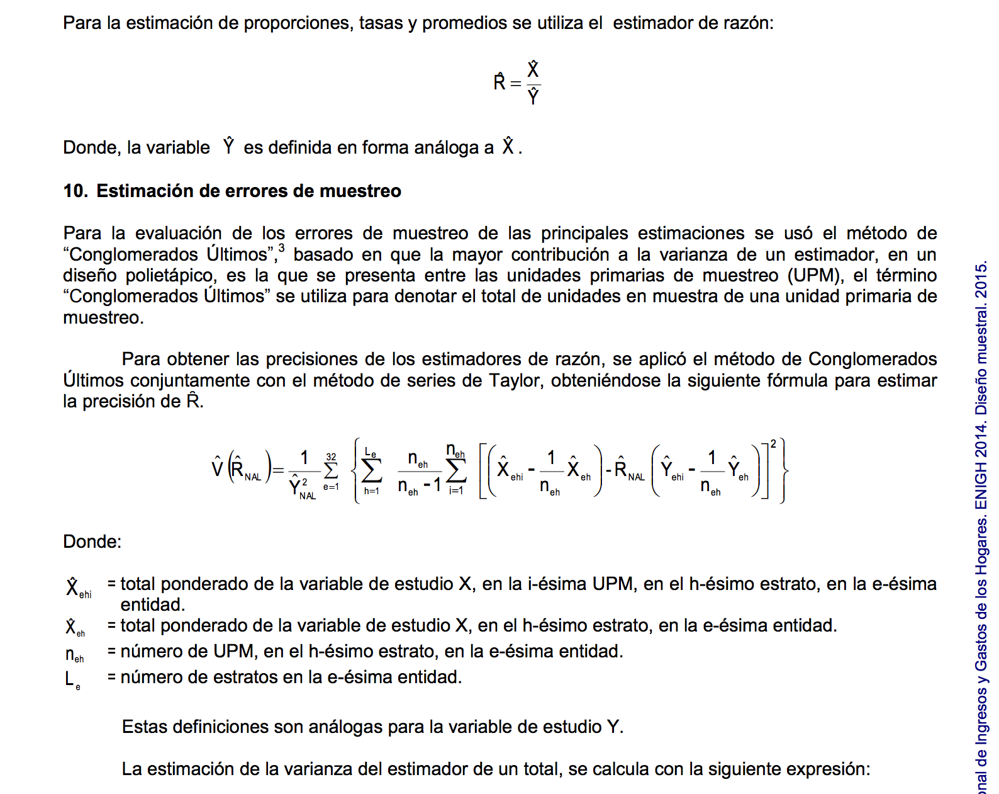

# Encuestas

```{r options, echo = FALSE, message=FALSE, error=TRUE, warning=FALSE}
knitr::opts_chunk$set(
    comment = "#>",
    collapse = TRUE, 
    cache = TRUE,
    warning = FALSE,
    message = FALSE,
    fig.width=3, fig.height=3
)
comma <- function(x) format(x, digits = 2, big.mark = ",")
options(digits=3)

library(tidyverse)
library(gridExtra)
theme_set(theme_minimal())
```

### Muestras complejas

La necesidad de estimaciones confiables junto con el uso eficiente de recursos
conllevan a diseños de muestras complejas. Estos diseños típicamente usan las
siguientes técnicas: muestreo sin reemplazo de una población finita, muestreo
sistemático, estratificación, conglomerados, ajustes a no-respuesta, 
postestratificación. Como consecuencia, los valores de la muestra suelen no ser
independientes y los análisis de los mismos dependerá del diseño de la muestra.
Comenzaremos con definiciones para entender el problema.

```{r}
set.seed(3872999)
n_escuelas <- 100
n_estudiantes <- 20
tipo <- sample(c("rural", "urbano", "indigena"), n_escuelas, replace = TRUE, 
    prob = c(0.3, 0.5, 0.2))

escuela <- data_frame(ind_escuela = 1:n_escuelas, tipo, 
    media_tipo = case_when(tipo == "urbano" ~ 70, tipo == "rural" ~ 60, TRUE ~ 40), 
    media_escuela = rnorm(n_escuelas, media_tipo, 10))
estudiantes <- data_frame(ind_estudiante = 1:(n_escuelas * n_estudiantes), 
    ind_escuela = rep(1:n_escuelas, each = n_estudiantes)) %>% 
    left_join(escuela) %>% 
    mutate(calif = rnorm((n_escuelas * n_estudiantes), media_escuela, 6))
```

Imaginemos que tenemos una población de `r n_escuelas`, cada una con `r n_estudiantes`
y queremos estimar la media de las calificaciones de los estudiantes en una prueba.

```{r}
estudiantes
```
La primera idea sería tomar una muestra aleatoria (MAS, muestreo aleatorio simple), 
donde todos los estudiantes tienen igual probabilidad de ser seleccionados. Con
estas condiciones el presupuesto alcanza para seleccionar a 30 estudiantes, hacemos 
esto y calculamos la media.

```{r}
muestra <- sample_n(estudiantes, 20)
round(mean(muestra$calif), 2)
```
Este número es relativamente cercano a la media verdadera de la población: 
`r mean(estudiantes$calif)`, pero esta es una de muchas posibles muestras.

```{r, fig.width=3, fig.height=2.8}
medias <- rerun(1000, mean(sample_n(estudiantes, 20)$calif)) %>% flatten_dbl()
sd(medias)

hist_mas <- ggplot(data_frame(medias), aes(x = medias)) +
    geom_histogram(binwidth = 2) +
    geom_vline(xintercept = mean(estudiantes$calif), color = "red") +
    xlim(40, 90)
```

Algunas de las muestras generan valores alejados de la verdadera media, para minimizar
la probabilidad de seleccionar muestras que lleven a estimaciones alejadas del 
verdadero valor poblacional podríamos tomar muestras más grandes:

```{r, fig.width=3, fig.height=2.8}
medias <- rerun(1000, mean(sample_n(estudiantes, 40)$calif)) %>% flatten_dbl()
sd(medias)

ggplot(data_frame(medias), aes(x = medias)) +
    geom_histogram(binwidth = 2) +
    geom_vline(xintercept = mean(estudiantes$calif), color = "red") +
    xlim(40, 90)
```

Pero los costos limitan el tamaño de muestra. Una alternativa es estratificar, 
supongamos que sabemos el tipo de cada escuela (urbana, rural o indígena) y 
sabemos también que los estudiantes de escuelas urbanas tienden a tener mejores
calificaciones que los estudiantes de escuelas rurales o indígenas.

```{r, fig.width=6, fig.height=2.8}
library(gridExtra)
muestra_estrat <- function(){
    estudiantes %>% 
        group_by(tipo) %>% 
        sample_frac(0.01)
}

medias <- rerun(1000, muestra_estrat()) %>% map_dbl(~mean(.$calif))
sd(medias)

hist_estrat <- ggplot(data_frame(medias), aes(x = medias)) +
    geom_histogram(binwidth = 2) +
    geom_vline(xintercept = mean(estudiantes$calif), color = "red") +
    xlim(40, 90)

grid.arrange(hist_mas, hist_estrat, nrow = 1)
```

La estratificación nos sirve para reducir el error estándar de las estimaciones, 
por su parte los conglomerados reducen costos. Veamos cuantas escuelas tendría 
que visitar en una muestra dada (con diseño estratificado).

```{r}
table(muestra_estrat()$ind_escuela)
```
Es fácil ver que visitar una escuela para aplicar solo uno o dos exámenes no es
muy eficiente en cuestión de costos. Es por ello que se suelen tomar muestras 
considerando los conglomerados naturales, en este caso la escuela. No es difícil 
imaginar que una parte grande del costo del muestreo sea mandar al examinador a
la escuela y que una vez ahí examine a todos los alumnos de sexto grado.


### Diseño ENIGH

**ENIGH**. Usaremos como ejemplo la Encuesta Nacional de Ingresos y 
Gastos de los Hogares [ENIGH](http://www.inegi.org.mx/est/contenidos/proyectos/encuestas/hogares/regulares/enigh/) (2014), esta encuesta usa un diseño de conglomerados estratificado.

Antes de proceder al análisis debemos entender el [diseño de la muetsra](http://www.beta.inegi.org.mx/app/biblioteca/ficha.html?upc=702825070359):

1. Unidad primaria de muestreo (UPM). Las UPMs están constituidas por 
agrupaciones de viviendas. Se les denomina unidades primarias pues corresponden
a la primera etapa de selección, las unidades secundarias (USMs) serían los 
hogares.

2. Estratificación. Los estratos se construyen en base a estado, ámbito (urbano, 
complemento urbano, rural), características sociodemográficas de los habitantes
de las viviendas, características físicas y equipamiento. El proceso de 
estratificación resulta en 888 subestratos en todo el ámbito nacional.

3. La selección de la muestra es independiente para cada estrato, y una 
vez que se obtiene la muestra se calculan los factores de expansión que 
reflejan las distintas probabilidades de selección. Después se llevan a cabo
ajustes por no respuesta y por proyección (calibración), esta última 
busca que distintos dominios de la muestra coincidan con la proyección de 
población de INEGI.

Para hacer análisis de datos procendentes de encuestas es necesario tomar en 
cuenta el diesño de la muestra y usar las funciones adecuadas para estimar
toatles, promedios, porcentajes y errores estándar de las estimaciones. Para ello
podemos leer la documentación del diseño muestral.

Veamos la tabla concentrado_hogar` debemos de consultar el diccionario de 
datos para entender las variables incluídas, de aquí podemos leer que la cada
renglón corresponde a un hogar, y la variable
`upm` indica las unidades primarias de muestreo, `est_dis` el estrato y `
factor_hog` es el factor de expansión.

```{r}
library(tidyverse)
concentrado_hogar <- read_csv("datos/concentradohogar_enigh2014tradicional/conjunto_de_datos/concentradohogar.csv")
glimpse(concentrado_hogar[, 1:20])
```

De la información colectada, `ing_cor` corresponde al ingreso corriente trimestral 
del hogar. Ahora, si queremos calcular el ingreso total del país debemos multiplicar
el valor de ingreso corriente de cada `upm` (es decir cada hogar) por el 
factor de expansión correspondiente y sumar los valores expandidos.

```{r}
sum(concentrado_hogar$ing_cor * concentrado_hogar$factor_hog)
```
Para calcular el ingreso promedio.

```{r}
sum(concentrado_hogar$ing_cor * concentrado_hogar$factor_hog) / sum(concentrado_hogar$factor_hog)
```
¿Cuál sería la estimación de ingreso promedio si ignoramos el diseño?

```{r}
mean(concentrado_hogar$ing_cor)
```

Ahora, el calculo de errores estándar requiere de más cálculos, por ejemplo, 
si quisieramos calcular el error estándar del ingreso promedio la fórmula 
del reporte metodológico sería:




Podemos usar la fórmula de arriba o utilizar software con funciones ya 
implementadas. En R hay varios paquetes para análisis de encuestas, `survey` es uno de los 
paquetes más usados y fue desarrollado por Thomas Lumely quien también escribió
el libro [Complex Surveys: A Guide to Analysis Using R](http://www.wiley.com/WileyCDA/WileyTitle/productCd-0470284307.html), este es un 
buen lugar para aprender más de diseño y análisis de encuestas. El paquete que 
veremos en estas notas es `srvyr`, este está construído sobre el paquete 
`survey` pero siguiendo una sintaxis similar análoga a `dplyr`. Aprenderemos a
usarlo con un ejemplo.

### Ejemplo: patrones de gasto por decil
Nos interesa analizar los patrones de gasto por decil de ingreso, para ello 
sigue los siguientes pasos.

1. Calcularemos los deciles de ingreso usando la variable de ingreso corriente 
(ing_cor). Reportando las estimaciones y sus errores estándar.

2. Crearemos una nueva variable que indique el decil de ingreso para cada hogar.

3. Estimaremos para cada decil, el porcentaje del gasto 
en cada categoría, reportando el error estándar de las estimaciones.

4. Realizaremos una gráfica con las estimaciones del paso 3.

Iniciamos preparando la base de datos que vamos a usar, para ello usamos las 
funciones del paquete `dplyr`.

```{r}
# comenzamos creando una base con las variables que necesitamos únicamente
hogar <- concentrado_hogar %>% 
    select(folioviv, foliohog, ubica_geo, est_dis, upm, factor_hog, ing_cor, alimentos, 
        vestido, vivienda, salud, transporte, comunica, educacion, esparci)

# para facilitar los cálculos ponemos las variables en un vector
vars_cats <- c("alimentos", "vestido", "vivienda", "salud", "transporte",
    "comunica", "educacion", "esparci")

# creamos una variable con el gasto total y el porcentaje de gasto en cada categoría
hogar_gastos <- hogar %>%
    mutate(gasto = alimentos + vestido + vivienda + salud + transporte + 
            comunica + educacion + esparci) %>% 
    mutate_at(vars_cats, funs(. / gasto))
```

Para usar las funciones de `srvyr` lo primero es especificar el diseño de la 
muestra.

```{r}
library(srvyr)
enigh_design <- hogar_gastos %>% 
    as_survey_design(ids = upm, weights = factor_hog, strata = est_dis)
enigh_design
```
El cálculo de errores estándar se puede realizar con fórmulas o con simulación, 
en este ejemplo usaremos simulación, en particular *bootstrap*.
```{r}
enigh_boot <- enigh_design %>% 
    as_survey_rep(type = "bootstrap", replicates = 600)

deciles_ingcor <- enigh_boot %>%
    srvyr::summarise(q_ing_cor = survey_quantile(ing_cor, seq(0.1, 1, 0.1))) %>% 
    gather(decil, corte)
deciles_ingcor
```

Creamos una nueva variable con los deciles.

```{r, message=FALSE}
library(Hmisc)
enigh_boot_q <- enigh_boot %>%
    mutate(decil = cut2(ing_cor, cuts = deciles_ingcor$corte))
```
Y realizamos las estimaciones por decil.

```{r}
# estimaciones
estimaciones <- enigh_boot_q %>% 
    group_by(decil) %>% 
    srvyr::summarise_at(vars_cats, survey_mean, na.rm = TRUE)

# errores estándar
estimaciones_se <- estimaciones %>% 
    select(decil, contains("se")) %>% 
    gather(campo, se, -decil) %>% 
    mutate(campo = stringr::str_extract(campo, ".*(?=_)"))

# unimos las dos para hacer la gráfica
estimaciones_tidy <- estimaciones %>% 
    select(decil, vars_cats) %>% 
    gather(campo, est, -decil) %>% 
    left_join(estimaciones_se)
```

Y graficamos.

```{r, fig.width=4.5, fig.height=3}
ggplot(estimaciones_tidy) +
    geom_line(aes(x = as.integer(decil), y = est, group = campo, color = campo)) +
    scale_x_continuous("decil", breaks = 1:10) 
```

Podemos hacer páneles para ver la variación en cada categoría.

```{r, fig.width=6.5, fig.height=4}
ggplot(estimaciones_tidy) +
    geom_line(aes(x = as.integer(decil), y = est, group = campo, color = campo), 
        show.legend = FALSE) +
    facet_wrap(~ campo, scales = "free_y", nrow = 2) +
    scale_x_continuous("decil", breaks = 1:10)
```

Y finalmente agregamos errores estándar.

```{r, fig.width=6.5, fig.height=4}
ggplot(estimaciones_tidy) +
    geom_line(aes(x = as.integer(decil), y = est, group = campo, color = campo), 
        show.legend = FALSE, alpha = 0.8) +
    geom_linerange(aes(x = as.integer(decil), ymin = est - 2 * se, ymax = est + 2 * se, 
        group = campo, color = campo), show.legend = FALSE, alpha = 0.8) +
    facet_wrap(~ campo, scales = "free_y", nrow = 2) +
    scale_x_continuous("decil", breaks = 1:10)
```

 Calcula la mediana del ingreso corriente por estado.

1. Lo primero que debes hacer es agregar la variable entidad a tus datos. 
Tip: de acuerdo al diccionario de datos la variable *ubicacion_geo*
contiene la clave de entidad.

    *ubica_geo: Ubicación geográfica, contiene la ubicación geográfica de la vivienda. 
    Los dos primeros dígitos representan la clave de la entidad, los siguientes tres 
    la clave del municipio y los últimos cuatro la clave de la localidad. Éstas 
    corresponden al Catálogo de claves de entidades federativas, municipios y 
    localidades, que está disponible en el sitio del INEGI.*

Por lo tanto debes comenzar creando una variable de entidad, para ello revisa
la ayuda de la función `str_sub()` del paquete `stringr`.

```{r, echo=FALSE}
library(stringr)
enigh_boot_edo <- enigh_boot %>% 
    mutate(edo = str_sub(ubica_geo, 1, 2))
```

2. Una vez que tienes la variable en tu diseño usa `group_by()` y `svy_median()`
para calcular la mediana en cada estado y el error estándar de las estimaciones.

```{r, echo = FALSE}
edo_ing_cor <- enigh_boot_edo %>% 
  group_by(edo) %>% 
  summarise(ing_cor = survey_median(ing_cor))
```

Ahora vemos como hacer un mapa con los resultados de nuestro análisis, para ello
usaremos el paquete [mxmaps](https://www.diegovalle.net/mxmaps/index.html). En este 
caso el `data.frame` con la información de ingreso corriente por estado se 
llama `edo_ing_cor`.

```{r, fig.width=6.5, fig.height=5}
library(mxmaps)

data(mxstate.map) # datos para hacer el mapa

mxstate_ing_cor <- mxstate.map %>% 
    left_join(edo_ing_cor, by = c("region" = "edo")) %>% 
    mutate(se = round(ing_cor_q50_se)) %>% 
    rename(mediana = ing_cor_q50)

# este es el mapa básico
mapa_ingcor <- ggplot(mxstate_ing_cor, aes(long, lat, group=group)) + 
    geom_polygon(aes(fill = mediana), color = "darkgray", size = 0.1)

mapa_ingcor +
    coord_map()
```

Podemos agregar interactividad con el paquete `plotly`.

```{r, fig.width=6.5, fig.height=4.5}
library(plotly)
library(ggmap)

# función para formatear con comas los datos de ingreso
comma <- function(x) format(x, digits = 2, big.mark = ",")

mapa_ingcor <- ggplot(mxstate_ing_cor, aes(long, lat, group=group, 
    text = str_c("ingreso corriente: ", comma(mediana)), label = se)) + 
    geom_polygon(aes(fill = mediana), color = "darkgray", size = 0.1) +
    theme_nothing(legend = TRUE) +
    scale_fill_distiller(palette = "YlGnBu", type = "div") + #paleta 
    labs(title = "Mediana de ingreso corriente", fill = "") 

ggplotly(mapa_ingcor, tooltip = c("text", "label"))
```

