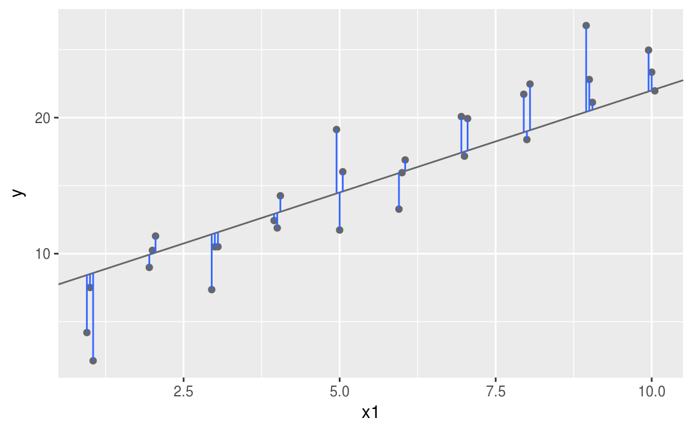

# Modelado


## ¿Qué aprendimos la clase pasada?

* Cómo analizar muestras complejas en R
  
En esta clase aprenderemos a:

* Utilizar modelos estadísticos para exploración de datos y para probar hipótesis.

## Modelos

El objetivo primordial de los modelos estadísticos es el de proveer un sumario simple de baja dimensión de un conjunto de datos. 

Idealmente un modelo captura la señal de interés (los patrones reals y generales del fenómeno que queremos estudiar) e ignora el "ruido" (e.g. variación aleatoria que no es de nuestro interés).

Vamos a proceder a estudiar cuál es la mecánica detrás de los modelos estadísticos concentrándonos en una familia muy importante de ellos: los modelos lineales.

### Generación de hipótesis vs confirmación de hipótesis 

Tradicionalmente, el objetivo del modelado estadístico fue la inferencia:plantear y comprobar hipótesis. Hacer esto correctamente no es complicado pero es difícil.

Hay que entender un par de ideas para poder llevar a cabo inferencia de una manera correcta:

* Cada observación de nuestro conjunto de datos base se puede usar para exploración o para confirmación pero nunca para ambas.

* Puedes usar una observación las veces que quieras para exploración, pero sólo la puedes usar una vez para confirmación. En cuanto uses una observación más de una vez estás automáticamente participando en un ejercicio exploratorio y no de confirmación.

Esto es necesario porque para confirmar una hipótesis se deben de usar datos independientes a los que se usaron para generar la hipótesis. De otra manera se está siendo optimista en cuanto a la solidéz de la hipótesis.

Se verá más adelante pero para llevar a cabo un análisis de confirmación para modelos estadísticos una manera de proceder es partiendo tu conjunto de datos en tres subconjuntos:

* ~60% para explorar y entrenar tu modelo. Tienes permitido hacer lo que sea con este subconjunto de tus datos: manipularlo a gusto, visualizarlo, ajustarle un montón de modelos, etc.

* ~20% un conjunto de consulta. Sirve para comparar modelos o visualizaciones, pero no está permitido usarlo en el ajuste de modelos.

* ~20% es el conjunto de prueba final. Sólo se puede usar este conjunto de datos UNA vez, para probar tu modelo final.


Esta partición permite explorar tus datos de entrenamiento, ocasionalmente generando hipótesis candidatas que se contrastan usando el conjunto de consulta. Cuando se tiene confianza en tener un buen modelo, se puede evaluar en el conjunto de prueba.

### Especificación de modelos

Hay dos partes fundamentales en un modelo:

* Primero, se define una familia de modelos que expresa de manera precisa, pero genérica, el patrón que se quiere capturar. Por ejemplo el patrón puede ser una línea recta:

$$ Y = \beta_{0} + \beta_{1}*X $$ 

Aquí, Y y X son variables conocidos de tus datos. $\beta_{0}$ y $\beta_{1}$ son parámetros que pueden capturar distintos patrones.

* Luego, en el ejercicio de modelado se encuentran los parámetros a la hora de ajustar el modelo, de manera tal que el modelo se encuentre "lo más cerca posible" a tus datos, por ejemplo:

$$ Y = 3 + 11X $$ 

Es importante recalcar que el modelo ajustado es el modelo más cercano a tus datos pero de una familia particular de modelos escogida a priori. Esto implica que se tiene el "mejor" modelo dado un cierto criterio muy particular. Definitivamente no implica que se tiene un buen modelo o que el modelo es "cierto":

```{r, echo=FALSE}

```

### Un primer modelo simple

Echémosle un vistazo a el conjunto de datos simulados sim1 (vienen en el tidyverse)

```{r}

# carguemos los paquetes

library(tidyverse)

library(modelr)

head(sim1)


```

Como podrán ver, consta de dos variables continuas únicamente (x,y).

Podemos usar lo aprendido en clases pasadas para visualizar la relación entre estas dos variables:

```{r}

ggplot(sim1, aes(x, y)) + 
  geom_point()


```

Es claro que existe un patrón fuerte entre las dos variables (¿Qué tipo?).

Ahora es nuestra tarea proponer un modelo para este conjunto de datos que capture el patrón de la mejor manera posible.

 Usar la función runif(), consultar su ayuda y explicar con sus palabras qué hace.

La función anterior nos dejará generar una gran cantidad de parámetros para producir modelos candidatos (como hemos venido trabajando sólo son dos parámetros los que requerimos para datos con dos variables).

```{r}

# parametros
modelos <- tibble(
  beta0 = runif(250, -20, 40),
  beta1 = runif(250, -5, 5)
)

ggplot(sim1, aes(x, y)) + 
  geom_abline(aes(intercept = beta0, slope = beta1), data = modelos, alpha = 1/4) +
  geom_point()

```

Pintamos 250 modelos candidatos sobre nuestros datos simulados ¡Muchos de ellos son realmente malos!

¿Cómo le hacemos para encontrar un buen modelo? ¿Cómo se formaliza la idea de que un buen modelo es uno que está "cerca" de nuestros datos? Necesitamos una manera de cuantificar la distancia de un modelo candidato a nuestros datos.Luego podemos buscar un modelo que encuentre valors para $\beta_{0}$ y $\beta_{1}$ de manera tal que el modelo esté a la menor distancia posible de los datos.

Un buen lugar para empezar es encontrar la distancia vertical de cada punto de nuestros datos a nuestro modelo (en este caso una línea recta).

```{r, echo=FALSE}

```


La intuición detrás de el ajuste de varias familias de modelos es que si puedes establecer una función que defina la distancia entre el modelo y el conjunto de datos, entonces un algoritmo puede minimzar tal distancia, efectivamente encontrando los mejores parámetros para tu modelo. Una muy común es la suma de los cuadrados de las distancias verticales antes mostradas, eso se denomina ajuste por mínimos cuadrados.

R tiene varias herramientas y paquetes para trabajar con modelos. Una función clásica es lm() que permite ajustar modelos lineales como los que hemos venido viendo. R tiene varias manera de especificar los modelos que se buscan ajustar. Por ejemplo, con una estructura llamada fórmula: Y ~ X que se traduce en:

$$ Y = \beta_{0} + \beta_{1}*X $$ 

```{r}

sim1_mod <- lm(y ~ x, data = sim1)

coef(sim1_mod)

```


 Una desventaja de los modelos lineales ajustados con mínimos cuadrados es que por tener términos al cuadrado se vuelven sensibles a valores inusuales (muy grandes - muy chicos). Ajusta un modelo a los datos simulados con el código abajo y visualiza los resultados ¿Qué notras sobre estos modelos? 

```{r}

sim1a <- tibble(
  x = rep(1:10, each = 3),
  y = x * 1.5 + 6 + rt(length(x), df = 2)
)

```

### Un modelo sobre datos más interesantes

En la carpeta datos se encuentran dos archivos. Uno de excel, con datos sobre ingresos per cápita por países. Otro, un archivo csv, con datos de esperanza de vida por países.

 Carguen estos datos en sus espacio de trabajo.

```{r,echo=FALSE}
library("tidyverse")
library("readxl")

# primero usar la función setwd() para ubicarnos en nuestra carpeta de trabajo

# cargar datos de ingreso
ingreso = read_excel("./datos/indicatorGNIpercapitaPPP.xlsx")

# cargar datos de esperanza de vida
esperanza = read_csv("./datos/IHME_GBD_2010_LIFE_EXPECTANCY_AND_HALE_BY_COUNTRY_1970_2010_Y2012M02D23.csv")

```

Con lo aprendido en las clases de manipulación y transformación de datos podemos convertir estas tablas de datos a otras que nos sirvan para estudiar la relación entre el ingreso per cápita y la esperanza de vida.

```{r}
# seleccionar campos de datos de ingreso: sólo año 2010
ingreso = ingreso %>%
          select(1,'2010')

# renombrar columnas
colnames(ingreso) = c("pais","GNI_capita_2010")

# filtrar datos de esperanza de vida: año 2010, ambos sexos, 20-24 años
esperanza = esperanza %>% 
            filter(year==2010,age_name=="20-24 years",sex_name=="Both")

```

 ¿Qué usaríamos para juntar estas dos tablas en una sola?.

```{r,echo=FALSE}
# join de las tablas anteriores
esperanza_ingreso = inner_join(esperanza, ingreso, by = c("country_name" = "pais"))

```

Si vemos la tabla de datos unificada, nos daremos cuenta que hay valores faltantes en el ingreso per cápita por país.

Podemos nuevamente usar filter para tirar tales registros.

```{r}
# tirar datos faltantes
esperanza_ingreso = esperanza_ingreso %>%
                    filter(!is.na(GNI_capita_2010))

```

Ahora estamos listos para ajustar un model lineal entre estas dos variables.

```{r}

# visualizar datos
ggplot(esperanza_ingreso, aes(GNI_capita_2010, le)) + 
  geom_point() +
  geom_text(aes(label=country_name),position=position_jitter(width=2,height=2),size=3)

# ajustar modelo
modelo <- lm(le ~ GNI_capita_2010, data = esperanza_ingreso)

# sumario del modelo
summary(modelo)

```

### visualización de predicciones

Para visualizar las predicciones de nuestro modelo se puede usar abline como se hizo anteirormente. Una manera más general de hacerlo es primero generar una gradilla regular sobre la región donde se encuentran nuestros datos. La manera más fácil de hacer esto es usando la función data_grid() del paquete modelr. Su primer argumento es un data frame y para cada argumento subsecuente encuentra valores únicos y genera todas las combinaciones:

```{r}

gradilla <- esperanza_ingreso %>% 
            data_grid(GNI_capita_2010) 

gradilla

```

Luego se pueden agregar predicciones, esto se hace con la función add_predictions(). Las agrega a una nueva columna del data frame.


```{r}

gradilla <- gradilla %>% 
            add_predictions(modelo) 

gradilla

```

Ahora podemos visualizar las predicciones. Te podrás preguntar por qué hacer todo esto si lo resolvimos antes de manera sencilla utilizando geom_abline(). La ventaja de esta manera de hacerlo es que funciona para cualquier modelo, del más simple al más complejo. 

Ver: http://vita.had.co.nz/papers/model-vis.html.

```{r}

ggplot(esperanza_ingreso, aes(GNI_capita_2010)) +
  geom_point(aes(y = le)) +
  geom_line(aes(y = pred), data = gradilla, colour = "red", size = 1)

```

Se puede observar que el modelo no es particularmente bueno ¿Cómo se puede cuantificar lo bueno o malo que es? Una posibilidad es con la información arrojada por la función summary. Otra es checando los residuales y llevando a cabo un ejercicio de particionado de los datos entrenamiento/prueba como se mencionó al principio de la clase.

### visualización de residuales

Los residuales son como el otro lado de la moneda de las predicciones. Las predicciones te indican qué patrón ha capturado el modelo, los residuales indican en cuánto ha fallado el modelo. Los residuales son simplemente las distancias entre los valores observados y predichos (por el modelo).

Agregamos los residuales a la tabla de datos con la función add_residuals(). Aunque aquí usaremos la tabla de datos original puesto que para computar los residuales se necesitan los valores observados.

```{r}

esperanza_ingreso <- esperanza_ingreso %>% 
                     add_residuals(modelo)

```

Hay varias cosas que se pueden estudiar con los residuales. Por ejemplo, si se grafica un polígono de frecuencias podemos visualizar su dispersión.

```{r}
ggplot(esperanza_ingreso, aes(resid)) + 
  geom_freqpoly(binwidth = 0.5)
```

Esto puede ayudar a calibrar el modelo: ¿qué tan lejos están las predicciones de los valores originales observados? En los modelos lineales de este tipo, por construcción la media de los residuales es 0.

También es informativo hacer visualizaciones utilizando los residuales en vez de la variable dependiente original.

```{r}

ggplot(esperanza_ingreso, aes(GNI_capita_2010, resid)) + 
  geom_ref_line(h = 0) +
  geom_point() 

```

En un buen modelo el gráfico anterior debe verse como ruido aleatorio. Aquí este no es el caso, por lo que es claro que no se han capturado bien los patrones del conjunto de datos.

Aún así, el modelo sí ayuda a concluir que hay una relación positiva entre ingreso y esperanza de vida.

 ¿Por qué crees que el modelo no logró capturar bien el patrón del conjunto de datos?.


 Entregar un script donde se lleve a cabo un ejercicio de particionado del conjunto de datos para encontrar el mejor modelo multivariado que explique el ingreso (al revés de como se ha venido trabajando):

$$ ingreso = \beta_{0} + \beta_{1}*esperanzaVidaGrupoEdad_1,...,\beta_{n}*esperanzaVidaGrupoEdad_n$$

Utilizar este modelo para estimar el ingreso de los datos faltantes 2010 ¿Se obtienen valores razonables? 
