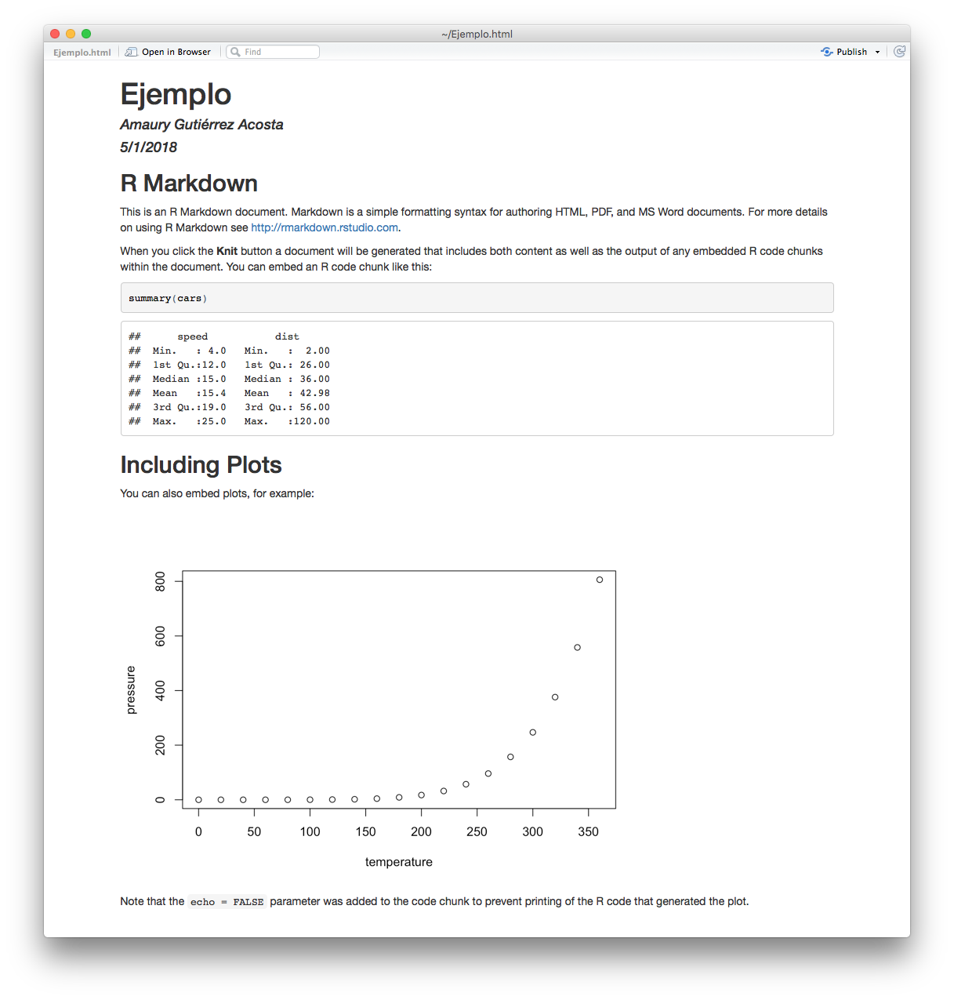
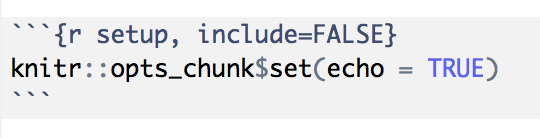

```{r setup, include=FALSE}
knitr::opts_chunk$set(echo = TRUE)
```

## R Markdown

Hasta ahora nos hemos enfocado en la parte del análisis de datos usando R. Este análisis no es útil si no se cominica de forma adecuada. Usualmente los reportes se hacen en Word o alguna otra herramienta de procesamiento de texto. En la última clase del curso introduciremos una alternativa para crear reportes llamada RMarkdown. Crear reportes con R ofrece algunas ventajas que enlistamos a continuación:

* Permite comunicar los resultados de un análisis a los tomadores de decisión sin exponer los detalles técnicos ni el codigo detrás del análisis.
* Facilita la colaboración entre distintas personas permitiendo expresar en un proceso (reproducible) el anális de los datos. 
* Intercalando texto y el código que se aplica sobre los datos se puede dar un panorama más amplio sobre lo que se estaba pensando cuando se escribió el código.

### Crear un documento

Para crear un documento RMarkdown con RStudio se especifíca el tipo de documento como RMarkdown al crear el archivo. Por ahora escogeremos HTML como formato de salida (la creación de PDF requiere paquetería externa y está fuera del alcance del curso). RStudio creará una plantilla con todo lo necesario para compilar el documento. RStudio instalará y cargará el paquete *rmarkdown* cuando sea necesario. Si queremos seguir el proceso de instalación que hemos usado para otros paquetes también es posible:

```{r, eval=FALSE}
install.packages("rmarkdown")
```

Después de crear nuestro documento podemos usar el botón con una madeja de estambre y el texto *Knit* y ver el resultado.



RStudio genera un archivo html auto-contenido que puede abrirse en cualquier navegador. Adicionalmente nos presenta una visualización del resultado. Analicemos ahora el contenido de nuestro archivo RMarkdown. Primero existe un header con información sobre el archivo como el título y el autor:

```
---
title: "Ejemplo"
author: "Amaury Gutiérrez Acosta"
date: "5/1/2018"
output: html_document
---
```

En general no modificaremos este contenido más que al principio del reporte. Otro tipo de contenido lo encontramos imediatamente en la forma de:




Lo cual nos da la receta para introducir código de R, *```{r}* Este es un bloque de código, *```* como un shorcut, si queremos introducir un bloque de código R en nuestro documento podemos teclear *ctrl + alt + i*. Esto introducirá un bloque de código que será ejecutado cuando el documento compile y será mostrado en el documento final. En ocasiones es posible que no queramos que el código sea ejecutado sino simplemente mostrado. Para esto casos se añade la opción *eval=FALSE* dentro de las llaves del bloque de código de la siguiente forma *{r, eval=FALSE}* el resultado se ve a continuación:

```{r}
2 + 2 # Se ejecuta y se muestra el resultado en el documento.
```

```{r, eval=FALSE}
2 + 2 # No se ejecuta, aparece únicamente el bloque de código en el documento.
```

Por último encontramos un bloque de texto común y corriente:

```
## R Markdown

This is an R Markdown document. Markdown is a simple formatting syntax for authoring HTML, PDF, and MS Word documents. For more details on using R Markdown see <http://rmarkdown.rstudio.com>.

When you click the **Knit** button a document will be generated that includes both content as well as the output of any embedded R code chunks within the document. You can embed an R code chunk like this:
```

Notemos que tiene algunos decoradores en el texto que producen un resultado distinto en el archivo resultante.

 Ejercicio 1: Analizar el resultado de la salida del documento y describir que hacen los decoradores en cada caso.

### Lenguaje Markdown

En esta sección detallaremos todos los decoradores de texto existentes en el lenguaje de marcado. Quizá pueda resultar complicado en un principio escribir de esta manera, sobre todo si estamos acostumbrados a procesadores de texto como Word, sin embargo con un poco de práctica se vuelve natural y rápido escribir usando esta herramienta.

Empecemos viendo algunos decoradores de texto:

```
*itálicas* _itálicas_

**negritas** __negritas__

`código`

superindice^2^

subíndice~2~
```

*itálicas* _itálicas_

**negritas** __negritas__

`código`

superindice^2^

subíndice~2~

Para los títulos tenemos usamos el símbolo hashtag, dependiendo del número de símbolos que usemos será el tamaño del título, se recomienda ampliamente usar los tamaños en concordancia con el contenido semántico del título, es decir las subsecciones deberán de usar más hashtags que las secciones a las que pertenecen. Por ejemplo:

```
# Capítulo

## Sección

### Subsección

#### Subsubsección

##### Esto ya es un poco exagerado

###### Pero puede llegar hasta seis símbolos
```

# Capítulo

## Sección

### Subsección

#### Subsubsección

##### Esto ya es un poco exagerado

###### Pero puede llegar hasta seis símbolos

También es posible crear listas de la siguiente manera:

Si queremos listas donde el orden no importa:

```
* Usamos asteriscos
* Para cada
* Elemento
- También pueden ser signos de "-"
+ o signos de "+"
```

* Usamos asteriscos
* Para cada
* Elemento
- También pueden ser signos de "-"
+ o signos de "+"

Para las listas ordenadas debemos usar un número seguido inmediatamente de un punto:

```
1. Primer elemento
2. Segundo elemento
3. Tercer elemento
3. El número no importa
999. Siempre que se siga el formato número punto
```

1. Primer elemento
2. Segundo elemento
3. Tercer elemento
3. El número no importa
999. Siempre que se siga el formato número punto

Si queremos crear un hiperlink a otro sitio usamos cualquiera de los siguientes formatos:

```
[Link a OXFAM Mexico](https://www.oxfammexico.org/)

https://www.oxfammexico.org/
```

[Link a OXFAM Mexico](https://www.oxfammexico.org/)

https://www.oxfammexico.org/

Si queremos introducir imágenes podemos hacerlo con o sin texto:

```


```


También es posible añadir bloques de texto usando la misma sintaxis que para los bloques de r pero sin el *{r}*:

```
Este es un bloque con formato de código
```

Si lo que queremos es usar tablas se acomoda la información de la siquiente forma:

```
|   |  A | B   | C  |  
|---|:---|:---:|---:|
| 1 |  w | sd  | ix |
| 2 |  f | dg  | jg |
| 3 |  x | po  | df |
```


|   |  Columna A | Columna B   | Columna C  |  
|---|:-----------|:-----------:|-----------:|
| 1 |  dato      | dato        | dato       |
| 2 |  dato      | dato        | dato       |
| 3 |  dato      | dato        | dato       |

Notemos que el símbolo de dos puntos ":" determina el alineado de las celdas.

Para agregar notas al pie usamos un formato similar al de los hiper vínculos:

```
Las notas al pie se agregan directamente en el texto [^1], de forma esta forma.

[^1]: Esta es una nota al pie.
```

Las notas al pie se agregan directamente en el texto [^1], de forma esta forma.

[^1]: Esta es una nota al pie.

 Ejercicio 2: Usando lo aprendido en esta sección crear un documento simple de una página utilizando los elementos de los que se ha hablado. Un ejemplo simple podría ser un curriculum vitae.

### Codigo de R incrustado

Finalmente profundizaremos en el codigo de R insertado en nuestro documento. Ya adelantamos el formato para hacerlo, ahora veremos que cualquier resultado visual se ejecutara y se colocará en el documento final. Esto permite una grán flexibilidad para nuestro reporte ya que permite agregar gráficas, tablas resultados de cierto análisis.

Por ejemplo si recordamos la primera sesión, podemos incluir la primera gráfica que hicimos en el curso.

Antes que nada debemos importar los paquetes que vayamos a utilizar como en cualquier sesión de trabajo. Si aún no hemos instalado los paquetes deberemos hacerlo, como en este caso ya lo tenemos instalado usaremos la opción para no evaluar el código ```eval=FALSE```:
```{r, eval=FALSE}
install.packages("tidyverse")
```

Notemos que cuando se carga tidyverse, los mensajes de alerta se adjuntan al documento. Esto puede llegar a ser no deseable por lo que es posible suprimirlos usando la bandera ```message=FALSE``` de forma similar al ```eval``` usado anteriormente

```{r, message=FALSE}
library(tidyverse)
```


```{r}
ggplot(mpg) + 
  geom_point(aes(x = displ, y = hwy, color = class))
```

