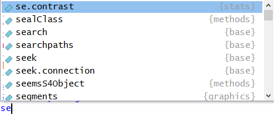
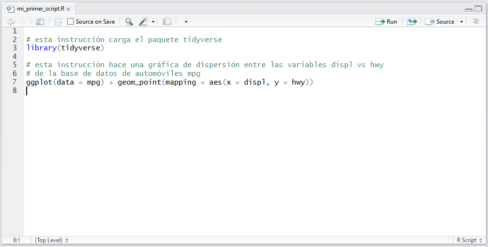
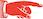

## ¿Qué aprendimos la clase pasada?

* Principios de visualización de datos utilizando el paquete ggplot2.
* Un primer ejemplo de manipulación de datos (la función filter).

## Esta clase:

* Utilizar R como calculadora.
* Asignar objetos a variables para poder utilizarlos después.
* Estudiaremos la lógica de las funciones en R.
* Utilizar scripts como archivos de texto donde apuntamos nuestro código.
* Utilizaremos un paquete de R para manipulación de tablas de datos
(__data frames__).

## Esta sección del curso se compone por dos clases. En la siguiente:

* Aprenderemos a leer archivos de datos en nuestro espacio de trabajo de R.
* Seguiremos trabajando con diversas técnicas para transformar y manipular datos.

## Conceptos preliminares:

### R como una calculadora

En la clase pasada omitimos algunos elementos básicos de R para lograr que pudiésemos comenzar a graficar lo más pronto posible.

Uno de esos elementos es que R puede llevar a cabo operaciones como una calculadora. La consola de R entiende expresiones matemáticas y las puede operar para obtener sus resultados.

```{r}
2+2

2000*99^2-444
```

Estas operaciones no se guardan en el espacio de trabajo. Al igual que cuando se usa una calculadora sin guardar un resultado en su memoria, al momento de producir el resultado se pierde la operación.

### Asignación de objetos en R

Para almacenar un resultado en el espacio de trabajo de R es necesario asignarlo a un objeto. Las asignaciones en R tienen siempre la misma forma:

<center>**nombre_del_objeto <- valor**</center>


Por ejemplo puedes asignar una de las operaciones anteriores a un objeto en R.

```{r}
operacion_1 <- 2+2

```

Escribir el nombre del objeto en la consola es equivalente a pregunarle a R ¿Qué hay en ese objeto?

```{r}
operacion_1

```

Es buena práctica ponerle nombres informativos a los objetos que estamos generando. Recomendamos usar la nomenclatura llamada **snake_case** que se refiere a separar las palabras del nombre de tu objeto con un "_".

Construyamos otro objeto que guarda el resultado de una operación.

```{r}
esta_operacion_es_sumamente_larga <- 2+2^21*2183176321/(22+2.56^121)+11111

```

RStudio tiene una herramienta de autocompletado de nombres, si escribes en la consola únicamente "esta" y aprietas la tecla Tab debe completar el nombre del objeto anterior.

### Funciones en R

Los comandos que se utilizaron la clase pasada para graficar se llaman funciones. Las funciones en R tienen la forma:

<center>**nombre_de_la_función(argumento1=valor1,argumento2=valor2,...)**</center>

El nombre de la función indica a R qué función se debe ejecutar. Cada función tiene asociada una lista de argumentos que le permiten saber a R qué le estás pidiendo que haga.

Como un primer ejemplo, la instalación de paquetes en R se puede llevar a cabo usando una función: install.packages(). Lo mínimo que necesita R para poder instalar un paquete es cuál debe instalar. Por esto el uso de esta función es simplemente install.packages(pkgs="nombre_del_paquete").

También debemos recordar que el símbolo "?" junto a una función nos permite acceder a la ayuda de R sobre la misma. 

Estudiemos ahora la función seq(), pueden escribir ?seq para ver la ayuda sobre esta función. Esta genera secuencias de números, por ejemplo para generar la secuencia de números enteros del 1 al 100 basta con escribir:

```{r}
seq(from=1,to=100)

```

Una observación útil es que el autocompletado de RStudio ¡sirve también para funciones! Intenta escribir "se" en la consola y luego oprimir la tecla Tab. Deberá aparecer un recuadro con un listado de opciones. 

```{r, out.width = "400px",echo=FALSE}

```

Escribir una letra más (e.g. "q") reduce la lista de opciones y la función seq deberá ya ser visible en ellas. Luego basta con oprimir la tecla Enter para elegir la función seq.

El resultado de utilizar una función se puede también asignar a un objeto. Esto será de gran utilidad a la hora de trabajar en R.

```{r}
secuencia_del_1_al_100 <- seq(from=1,to=100)

```

En la sección superior derecha de nuestro ambiente de RStudio ya deben existir dos objetos cargados en el espacio de trabajo: "esta_operacion_es_sumamente_larga" y "secuencia_del_1_al_100". Estos ya están cargados en la memoria RAM de la computadora y R puede acceder a ellos cuando se les solicite utilizando su nombre.

```{r, out.width = "700px",echo=FALSE}
knitr::include_graphics("./imagenes/3_espacio_trabajo.png")
```

 ¿Por qué no funciona el siguiente código? Modifícalo hasta que cada instrucción funcione.

library(tidyverse)

ggplot(dota = mpg) + geom_point(mapping = aes(x = displ, y = hwy))

fliter(mpg, cyl = 8)

filter(diamond, carat > 3)

### Scripts en R

Se puede escribir código de R en cualquier procesador de texto, por ejemplo en word. La conveniencia de tener un procesador de texto dentro de tu ambiente de trabajo (RStudio) es que te permite mandar las instrucciones diréctamente a la consola para su ejecución. 

En un script el símbolo # le indica a R que esa línea es un comentario. Los comentarios no se ejecutan y sirven para tener notas para nosotros mismos sobre el código que estamos desarrollando. Cuando una línea de texto es un comentario, será de color verde.

```{r, out.width = "700px",echo=FALSE}

```

Para ejecutar el código que se encuentra en un script se pueden utilizar las teclas: Ctrl/Cmd (mac) + Enter o el botón "Run" que se encuentra en la esquina superior derecha de la ventana de scripts. En un script puedes correr una línea en particular (primero la eliges con el mouse, botón izquierdo). También puedes correr una selección de tu script, para esto sólo debes elegir una sección de tu código dejando apretado el botón derecho del mouse o con la tecla shift y las flechas del teclado; análogo a como se hace en word.

### Diagnósticos de RStudio

Como se sabe que R es tan moléstamente quisquilloso, RStudio tiene integrado un detector de errores de sintaxis. 

Un error tremendamente común es que siempre que se abran paréntesis, se deben cerrar (). Por ejemplo a la hora de usar alguna función. Si RStudio detecta que en una línea hay paréntesis sin pareja la marcará con una cruz roja.

```{r, out.width = "700px",echo=FALSE}
knitr::include_graphics("./imagenes/5_unmatched_bracket.png")
```

Por supuesto existen muchísimos posibles errores en R. Si se comete alguno RStudio tratará de informarte sobre la naturaleza del error, basta con colocar el puntero del mouse sobre la cruz roja para ver esta nota.

### Operadores relacionales

Sirven para comparar dos cantidades. Regresan __TRUE__ si la comparación es
cierta y __FALSE__ en otro caso.

Ejemplos:

```{r}
5 == 5 # Notar que se pone doble igualdad para comparar dos cantidades
5 > 6
5 < 6
6 >= 3
6 <= 3.4

# Otro operador muy útil para ver si un elemento se encuentra en un vector
c(1, 2, 3) # Formando un vector que contiene los números 1, 2, 3
5 %in% c(1, 2, 3)
2 %in% c(1, 2, 3)
```

### Operadores booleanos

Sirven para comparar dos expresiones como las anteriores:

El operador __y__ (&) regresa verdadero si las dos expresiones que recibe son
verdaderas y falso en otro caso.

```{r}
(5 > 6) & (7 < 8) # Y: notar que regresa false porque 5 > 6 es falso
(5 < 6) & (7 < 8)
(5 > 6) & (7 > 8)
```

El operador __o__ (|) regresa verdadero si __alguna__ de las expresiones que
recibe es verdadera y falso en otro caso.

```{r}
(5 > 6) | (7 < 8) # O: notar que regresa true conque alguna de las expresiones sea verdadera
(5 < 6) | (7 < 8)
(5 > 6) | (7 > 8)
```

El operador lógico __no__ (! regresa verdadero si la expresión que recibe es
falsa y viceversa)

```{r}
5 > 6
!(5 > 6)
```

 Evalúa una a una las siguientes expresiones y
explica por qué da TRUE o FALSE. Sugerencia: compréndelas una a una y en orden.

```{r, eval=FALSE}
5 < 7
!(5 < 7)
5 > 6
6 <= 6
6 >= 6
!(5 < 7) & (5 > 6)
(!(5 < 7) & (5 > 6)) | (6 <= 6)
!(5 < 7) & ((5 > 6) | (6 <= 6))
```

## El paquete dplyr (instalado con el tidyverse)

```{r, message==FALSE}
# Cargando el paquete
library("tidyverse")
```

Un data frame se compone de __registros__ (renglones) y __campos o variables__ (columnas):


Con **dplyr** se podrán realizar acciones muy útiles como las siguientes:

1. **Seleccionar** campos de un data frame
2. **Filtrar** registros de un data frame que cumplan cierta condición.
3. **Ordenar** registros de acurdo a su valor en ciertos campos.
4. **Crear** nuevas columnas a partir de los valores de las preexistentes
5. **Calcular resúmenes** de **agregados** de datos (como las tablas dinámicas en
Excel).
6. **Unir tablas** de acuerdo a sus valores en ciertos campos (se verá más adelante).

### 1. Seleccionar campos de un data frame: select(df, columnas_a_seleccionar)

```{r}
# Usaremos el data frame diamonds cargado con "tidyverse"
glimpse(diamonds)
# View(diamonds) # Para ver el data frame en formato de Excel.

diamonds_columnas_selectas <- select(diamonds, carat, cut)
diamonds_columnas_selectas

# Otras maneras de seleccionar columnas:
select(diamonds, starts_with("c"))
select(diamonds, contains("able"))
select(diamonds, -carat, -cut, -color)
```

 Crea un data frame nuevo a partir de diamonds con
las columnas carat, x, y, z únicamente.

### 2. Filtrar registros de un data frame que cumplen cierta condición: filter(df, condiciones)

```{r}
diamonds_registros_selectos <- filter(diamonds, cut == "Ideal", x > 4)
diamonds_registros_selectos

# Otras maneras de filtrar registros
filter(diamonds, cut == "Ideal" & x > 4)
filter(diamonds, cut == "Ideal" | x > 4)

```

 Crea un data frame nuevo a partir de diamonds
que contenga los registros que cumplen la condición: '__alguna__ de x, y, z  es mayor a 3.5'

### 3. Ordenar registros de un data frame por los valores en una o más variables: arrange(df, variables_de_ordenamiento)

```{r}
diamonds_ordenado <- arrange(diamonds, carat, depth)
diamonds_ordenado
# desc(variable): ordena en sentido decreciente (Z-A), (mayor a menor, etc)
arrange(diamonds, carat, desc(depth))
arrange(diamonds, desc(carat), depth)
```

 Crea un data frame nuevo a partir de diamonds
que contenga los registros organizados alfabéticamente por "color"", y por "carat"
de manera descendente.

### 4. Crear nuevas variables: mutate(df, formulas)

```{r}
diamonds_nueva_variable <- mutate(diamonds, dollars_per_carat = price / carat)
```

 Crea un data frame nuevo a partir de diamonds
que contenga la variable "dollars_per_carat" anterior, y la variable "product"
calculada como x \times y \times z.

### 5. Agrupar por ciertas variables: group_by(data_frame, variables) y crear resúmenes por grupo: summarise(data_frame, formulas)

* Para crear resúmenes de un data frame se utiliza la función __summarise__.
* Si se agrupan los datos antes (utilizando la función __group_by__), se pueden crear
resúmenes por nivel de las variables de agregación (definidas en el group_by).
Esto es análogo a las tablas dinámicas en Excel.

```{r}
# Calcular el promedio de depth y la mediana de price y asignarlos a las
# variables "promedio_depth" y "mediana_price"
diamonds_resumen <- summarise(diamonds, promedio_depth = mean(depth), mediana_price = median(price))
diamonds_resumen

# Calcular el promedio de depth y la mediana de price y asignarlos a las variables
# "promedio_depth" y "mediana_price", por nivel de "cut"
# Primero agrupo por la variable de interés
diamonds_agrupado <- group_by(diamonds, cut)
diamonds_agrupado

# Y calculo resúmenes para cada nivel de dicha variable
diamonds_resumen_por_grupo <- summarise(diamonds_agrupado, promedio_depth = mean(depth), mediana_price = median(price))
diamonds_resumen_por_grupo
```

Algunos resúmenes útiles con _summarise_ son:

* El mínimo de un campo x: __min(x)__
* La mediana de un campo x: __median(x)__
* El máximo de un campo x: __max(x)__
* El número de registros: __n()__
* La suma de un campo x: __sum(x)__
* La desviación estándar de un campo x: __sd(x)__.

 __Tarea:__ Crea un data frame nuevo a partir de
diamonds que contenga el número de registros para cada combinación de valores en
las variables "cut" y "color".

 __Tarea:__ Explica las diferencias que notas
entre los data frames obtenidos de:
```{r, eval=FALSE}
diamonds_agrupado <- group_by(diamonds, cut)
resultado_1 <- summarise(diamonds_agrupado, promedio_depth = mean(depth))
resultado_2 <- mutate(diamonds_agrupado, promedio_depth = mean(depth))
```

 __Tarea:__ Partiendo del data frame diamonds,
crea un data frame nuevo con las siguientes características:

1. Contenga la variable dollars_per_carat = price / carat

2. Contenga sólo aquellos registros que cumplen dollars_per_carat < 4000

3. Esté ordenado en orden descendente por la variable dollars_per_carat