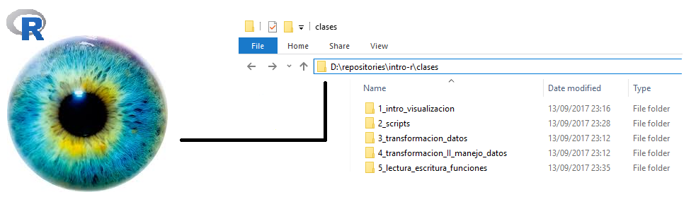
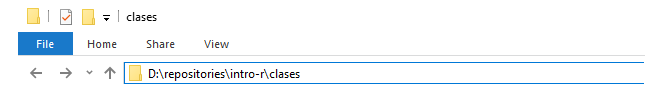
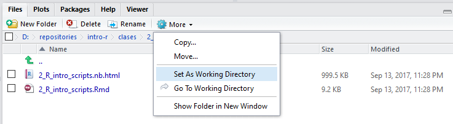

# Transformación-II


## ¿Qué aprendimos la clase pasada?

* Utilizamos R para saber si comparaciones entre dos cantidades son ciertas o no
  (5 > 6 #FALSE, 6 == 6 #TRUE)
* Aprendimos el uso de los operadores y (&), o (|) y no (!):
  (5 > 6) | (3 < 4) #TRUE
* Aprendimos las funciones básicas para manipular __tablas de datos__ (paquete
  __dplyr__ contenido en el tidyverse):
  
```{r, echo=FALSE, warning=FALSE, message=FALSE}
library("tidyverse")
library("knitr")

df_funciones_dplyr <- data_frame(
    Funcionalidad = c(
      'Seleccionar campos',
      'Seleccionar registros de acuerdo a un criterio',
      'Ordenar registros de acuerdo a uno o más campos',
      'Crear nuevas variables',
      'Preparar un data frame para calcular resúmenes por grupo',
      'Calcular resúmenes por grupo'
      ),
    Función = c(
      'select(diamonds, carat, cut)',
      'filter(diamonds, cut == "Ideal" | x > 4)',
      'arrange(diamonds, carat, depth)',
      'mutate(diamonds, dollars_per_carat = price / carat)',
      'diamonds_agrupado <- group_by(diamonds, cut)',
      'summarise(diamonds_agrupado, promedio_depth = mean(depth))'
    ),
    Interpretación = c(
      'Del data frame diamonds __seleccióname los campos__ carat y cut',
      'Del data frame diamonds __seleccióname los registros (filter)__ que cumplen "cut == "Ideal" o (|) "x > 4"',
      'Del data frame diamonds __ordéname los registros__ primero por carat y luego, los que tengan valores iguales, por depth',
      'Usando el data frame diamonds __créame la nueva columna__ dollars_per_carat definida como price / carat',
      'Usando el data frame diamonds, __prepárame los datos__ para calcular resúmenes por valor de la columna cut, y __asigna__ el resultado a la variable diamonds_agrupado',
      'Usando diamonds agrupado, __calcúlame el resumen__ llamado promedio depth definido como la media de depth'
    )
  )
  kable(df_funciones_dplyr)
```

En esta clase aprenderemos a:

* Utilizar el operador __pipeline__ para simplificar la aplicación de funciones
de transformación de datos, una tras otra (recordar la tarea, ejercicio 3).
* Miscelánea de funcionalidades avanzadas de transformación de datos:
    + __joins__ (uniones de dos o más tablas).
    + El paquete __tidyr__ para transformar la __estructura__ de los datos en una tabla.
* Un poco acerca de datos faltantes.
* Leer datos en R.

## El operador pipeline %>%

El ejercicio 3 de la tarea nos introduce a lo tedioso que es aplicar varias
funciones para transformar datos una tras otra sin ayuda. Aquí es cuando el operador
pipeline entra en acción:

Nos permite encadenar operaciones de manera sencilla, comenzando por el data frame
original (diamonds), luego aplicar una transformación, al resultado aplicar otra
y así sucesivamente.

Retomemos el ejemplo de la tarea 3. En lugar de:
```{r}
diamonds_dollars_per_carat <- mutate(diamonds, dollars_per_carat = price / carat)
diamonds_dollars_per_carat

diamonds_dollars_per_carat_filtrado <- filter(diamonds_dollars_per_carat, dollars_per_carat < 4000)
diamonds_dollars_per_carat_filtrado

diamonds_dollars_per_carat_filtrado_ordenado <- arrange(diamonds_dollars_per_carat_filtrado, desc(dollars_per_carat))
diamonds_dollars_per_carat_filtrado_ordenado
```

El ejemplo de la tarea 3 queda:
```{r}
diamonds %>% # Comenzando con el df diamonds:
  mutate(dollars_per_carat = price / carat) %>% # Calcúlame la variable dollars per carat ... LUEGO
  filter(dollars_per_carat < 4000) %>% # Seleccióname los registros en que la variable dollars_per_carat < 4000 LUEGO
  arrange(desc(dollars_per_carat)) # Ordéname en orden descendente por la variable dollars per carat
```

Podemos también asignar el resultado de TODAS las transformaciones anteriores
a una variable
```{r}
diamonds_transformado_1 <- diamonds %>%
  mutate(dollars_per_carat = price / carat) %>%
  filter(dollars_per_carat < 4000) %>%
  arrange(desc(dollars_per_carat))
diamonds_transformado_1
```

Otro ejemplo:

* Por combinación de cut y color,
* Calcular el mínimo de x, y también el máximo de y.
* Al resultado ordenarlo por color de manera descendente.

```{r}
diamonds_transformado_2 <- diamonds %>%
  # Primero agrupo por combinación de cut y color, ya que lo necesito para calcular
  # los resúmenes por grupo
  group_by(cut, color) %>%
  # Luego calculo los resúmenes por grupo
  summarise(minimo_x = min(x), maximo_y = max(y)) %>%
  # Finalmente ordeno por color
  arrange(desc(color))
diamonds_transformado_2
```


## Miscelánea de funcionalidades avanzadas de transformación de datos

Con __dplyr__:

1. Realizar __joins__ entre dos tablas.

Con __tidyr__:

2. __Spread__: transformar registros en campos
3. __Gather__: transformar campos en registros
4. __Separate__: separar variables

### 1. Joins: inner_join(df1, df2, columnas_a_seleccionar)

Es común encontrarse tablas que hacer referencia la una a la otra, por ejemplo:

```{r, echo=FALSE, }
tipos_caracter <- data_frame(
  id = c(1, 2, 3),
  tipo = c("letra", "número", "caracter especial")
)
kable(tipos_caracter, caption = "Tipos de caracter")

caracteres <- data_frame(
  id = 1:10,
  caracter = c("a", "2", "3", "1", "z", "5", "m", "7", "s", "x"),
  tipo_caracter_id = c(1, 2, 2, 2, 1, 2, 1, 2, 1, 1)
)
kable(caracteres, caption = "Caracteres", align = rep('c', 3))
```

Para asociar a cada caracter su tipo, podemos utilizar una funcionalidad llamada
__join__, que básicamente asocia registros de dos tablas usando campos en común.

```{r}
# Definiendo las tablas anteriores (normalmente estas tablas se leerán de archivos
# CSV o bases de datos como se verá en esta clase).

tipos_caracter <- data_frame(
  id = c(1, 2, 3),
  tipo = c("letra", "número", "caracter especial")
)
tipos_caracter

caracteres <- data_frame(
  id = 1:10,
  caracter = c("a", "2", "3", "1", "z", "5", "m", "7", "s", "x"),
  tipo_caracter_id = c(1, 2, 2, 2, 1, 2, 1, 2, 1, 1)
)
caracteres

# Haciendo el join de las tablas anteriores
inner_join(caracteres, tipos_caracter, by = c("tipo_caracter_id" = "id"))

# Notemos que el orden importa para renombrar y ordenarlas columnas
inner_join(tipos_caracter, caracteres, by = c("id" = "tipo_caracter_id"))

# Existen muchos tipos de joins, y también joins por más de un campo. Para ver
# estas opciones consultar la ayuda de R: ?inner_join.
```

 Expresa el join anterior usando el pipeline.

 Evalúa las siguientes expresiones y explica
con tus palabras el resultado.
```{r, eval=FALSE}
left_join(tipos_caracter, caracteres, by = c("id" = "tipo_caracter_id"))
semi_join(tipos_caracter, caracteres, by = c("id" = "tipo_caracter_id"))
anti_join(tipos_caracter, caracteres, by = c("id" = "tipo_caracter_id"))
```

### Un intermedio. Lectura de datos en R

La mecánica de lectura en R es sencilla y, sin importar el tipo de archivo que se quiera cargar a nuestro espacio de trabajo, siempre tiene la misma forma: se utiliza una función preparada para cargar un cierto tipo de archivo y luego se le debe indicar a R dónde está el archivo (de este tipo) que se desea cargar.

R tiene tiene una única manera de saber dónde buscar un archivo. Debe recibir una dirección que le indique dónde buscar físicamente el archivo de interés. 

```{r, echo=FALSE}

```

R puede "ver" lo que sea que le muestres, esto es, puedes decirle exáctamente dónde debe buscar un archivo, por ejemplo indicando con una cadena de texto una ruta completa en nuestro sistema de archivos (disco duro): "D:\\repositories\\intro-r\\". Estas rutas se pueden escribir manualmente, o se pueden copiar del explorador de archivos de nuestro sistema operativo y luego pegarla en R. 

```{r, echo=FALSE}

```

Es muy importante notar que en Windows, la convención es usar diagonales invertidas "\\" para separar los niveles de nuestra ruta. R no va a entender que algo es una ruta si está construída con estos símbolos. Si se copia y pega una ruta desde nuestro explorador de archivos en Windows, debemos cambiar las diagonales invertidas por diagonales: "D:/repositories/intro-r/".

Otra posibilidad, también ya mencionada, es indicarle a R que "vea" una carpeta de trabajo. En este momento R está "viendo" la siguiente carpeta:

```{r}
getwd()
```

Estoy indica que R no necesita una ruta completa para leer cualquier cosa incluída en la carpeta anterior. Únicamente el archivo. Para cambiar la carpeta de trabajo se utiliza la funcón setwd() que como argumento escencial recibe una ruta.

Se recomienda trabajar un proyecto dado en un carpeta que a su vez contenga una carpeta que amacene los datos que se usen para ese proyecto en particular. Por ejemplo una carpeta llamada "datos", así las rutas a los archivos siempre pueden ser carpetas relativas. No importa si la carpeta del proyecto se copia a otro equipo de cómputo, bastará con hacer setwd() a la carpeta del proyecto para que todo el código funcione.

Otra cosa que vale la pena mencionar es que RStudio incluye un explorador de archivos, ahí se puede navegar en las carpetas de nuestra computadora y con las opciones disponibles en el ícono de engrane se puede también asignar la carpeta de trabajo.

```{r, echo=FALSE}

```

Es común que las tablas de datos se distribuyan como archivos de texto. Existen numerosas variaciones de estos archivos de texto y csvs.

El tidyverse incluye al paquete readr que tiene como objetivo convertir este tipo de archivos en data frames, aunque archivos de este tipo delimitados por comas es lo más común, nos podemos encontrar con archivos delimitados por otros símbolos, de aquí que existan las siguiente funciones:

* read_csv2() que lee archivos separados por punto y comas ";"
* read_tsv() lee archivos separados por Tabs
* read_delim() lee archivos separados por cualquier símbolo (tú lo determinas con un argumento)
* read_fwf() lee archivos de anchos fijos, se pueden especificar los anchos con fwf_widths() o su posición en el espacio (fila de datos) con fwf_positions().
* read_table() lee un caso muy particular y popular de lo anterior que son archivos con datos separados por un único espacio. 

Como ya se mencionó, todas estas funciones tienen una sintaxtis similar. Lo más importante es alimentarles bien la ruta del archivo que se desea leer.

Aunque este tipos de archivos son extremadamente populares en el mundo de los archivos de datos, existen numerosas otras presentaciones. Por ejemplo, es muy común el uso de Microsoft Excel para análisis cuantitativo. R está bien preparado para leer y escribir archivos excel.

Bajaremos datos de Incidencia de Víctimas de homicidio, secuestro y extorsión de datos.gob.mx:

https://datos.gob.mx/busca/dataset/victimas-de-homicidio-secuestro-y-extorsion-excel

Para leer estos datos se utilizaremos el paquete readxl (no se les olvide instalarlo)

```{r,echo=FALSE}
setwd("/Users/agutierrez/Documents/R/r/")
```

```{r}

# cargar el paquete
library("readxl")

# ¿dónde está el archivo? recordar usar rutas relativas:
ruta_relativa <- "./datos/Estatal_Victimas_2015_2018_feb.xlsx"

# leer este archivo 
datos <- read_excel(ruta_relativa,sheet=1)

```

### 2. Usar spread para transformar registros de un data frame en campos.

Al transformar registros en campos, se quitan renglones y se agregan columnas,
lo que se llama datos **anchos**.

Es importante notar que gather y spread son funciones inversas.

Primero veamos el estado original de la tabla de datos, tiene múltiples columnas que corresponden a muchos cortes en la naturaleza de los crímenes cometidos (Estado donde se comentió, mes cuando se comentió, sexo de la víctima, tipo de crimen, etc).

```{r}
# renombrar la primera variable porque incluye un molesto símbolo especial: ~
datos <- rename(datos, Anio = Año)


# generar totales por mes
datos <- datos %>% 
         mutate(total = select(.,Enero:Diciembre) %>% rowSums())

```

Ahora sí vamos a pasar la tabla de datos a un formato largo con base en los tipos de delitos

```{r}

# trabajar sólo Homicidios y Feminicidios, pasar a los datos a formato largo por año

# Usando la función spread para transformar registros en campos:
# key: variable cuyos valores definirán los nombres de nuestros campos. Para
# revertir el data frame usaremos "enfermedad"

tipos_delito = datos %>% 
                  spread(key = `Tipo de delito`, value = total)

```

Ya que está en formato largo, se puede generar una útil tabla de conteo de delitos cruzado por Entidad, Año y Sexo.

```{r}

# cantidad de subtipos de delito por entidad, año y sexo
cantidad_tipos <-    tipos_delito %>% 
                     group_by(Entidad,Anio,Sexo) %>%
                     summarise_at (.vars=vars(Aborto:Secuestro),.funs=sum,na.rm=TRUE)

```


### 3. Usar gather para transformar campos de un data frame en registros

Al transformar campos en registros, se quitan columnas y se agregan renglones al
data frame. Esto se llama datos **largos**.

Podemos usar esta operación para eliminar las columnas-delitos de la tabla de datos anterior y agregarla a unas columnas de conteos por delito (estructura: nombre delito, conteo)

```{r}
# Usando la función gather para transformar campos en registros:
# key: nombre de la columna con los nombres de los campos (ahora registros)
# value: nombre de la columna con los valores de los campos (numero_pacientes)
# lo que sigue son las columnas que definen los campos que se transformarán en renglones
cantidad_tipos_largos <- gather(cantidad_tipos, 
                                key = "tipo_delito", 
                                value = "num_delitos_cometidos",
                                Aborto:Secuestro)

```

 A partir de los datos originales, crear otra tabla que sea interesante utilizando las funciones gather o spread y las otras funciones de manipulación vistas hasta ahora. Investigar el uso de la función de escritura de texto delimitado write_csv(), también del paquete reader, y utilizarla para guardar la tabla de datos anterior a su carpeta "datos".

### 4. Separar una columna en dos o más: separate(df, col = columna, into = c(nueva_variable_1, nueva_variable_2, etc)

Separate es una función útil para separar una columna de un data frame en varias
columnas, cuyos nombres se especifican. La separación default se realiza por
caracteres especiales (., _, espacios, etc). Por ejemplo:

```{r}
instructores_curso_r <- data_frame(
  id = c(1,2,3),
  nombre = c(
    "Amaury Gutiérrez",
    "Teresa Ortiz",
    "Julian_Equihua"
  )
)
instructores_curso_r

separate(instructores_curso_r, nombre, into = c("nombre", "apellido_1"))
```

 Evalúa las siguientes expresiones, y explica
con tus palabras lo que sucede
```{r, eval=FALSE}
instructores_curso_r_1 <- data_frame(
  id = c(1,2,3),
  nombre = c(
    "Fernando Pardo Urrutia",
    "Teresa Ortiz",
    "Julian_Equihua"
  )
)

separate(instructores_curso_r_1, nombre, into = c("nombre", "apellido_1"))
separate(instructores_curso_r_1, nombre, into = c("nombre", "apellido_1", "apellido_2"))
```

 Da una explicación intuitiva de lo que es el __NA__

## Datos faltantes

Un __NA__ es un dato faltante, es decir, un vacío en una tabla. Como en R los data
frames contienen un elemento en cada campo, estos vacíos se traducen como datos faltantes.

__Como son vacíos de información, los datos faltantes se pueden pensar como "no sé"__

```{r}
NA # Dato Faltante
NA + 3 # No se + 3 = No sé
NA * 3 # No se * 3 = No sé
is.na(NA) # Un operador binario para preguntar si un dato es faltante (NA)
is.na(5.3)
is.na(FALSE)
FALSE | NA # No se cuánto da FALSE ó NA
TRUE | NA # Pero TRUE o NA sí, porque sabemos que verdadero ó lo que sea ya es verdadero: como (5 > 3) | (1 > 3)
NA > 5 # ¿Es NO SE > 5? NO Sé
NA == NA #¿Es NO SE igual a NO SÉ? NO SÉ
sum(c(4, 5, 6, NA)) # No se cuanto da la suma de algo 4, 5, 6, y no sé.
sum(c(4, 5, 6, NA), na.rm = TRUE) # Pero puedo decirle a R que remueva los NA's
mean(c(4, 5, 6, NA), na.rm = TRUE)

# Dado un data frame con datos faltantes
registro <- data_frame(
  id = c(1, 2, 3),
  persona = c("Fernando", NA, "Julián"),
  numero_socio = c(13, 12, NA)
)
registro

# Puedo seleccionar renglones con NA:
registro %>%
  filter(is.na(persona))

# O renglones sin NA:
registro %>%
  filter(!is.na(persona))

# Puedo usar las reglas anteriores para calcular nuevas columnas:
registro %>%
  mutate(numero_socio_nuevo = numero_socio + 1)

# Puedo ordenar y los NA's quedan al final
registro %>%
  arrange(numero_socio)

# Puedo ordenar y los NA's quedan al final
registro %>%
  arrange(desc(numero_socio))

# Tengo que tener cuidado con calcular resúmenes de data frames que contienen NA's
registro %>%
  summarise(promedio = mean(numero_socio))

# Pero puedo arreglarlo fácilmente
registro %>%
  summarise(promedio = mean(numero_socio, na.rm = TRUE))
```

 Entregar un script donde se lleve a cabo un proceso de manipulación y transformación de datos sobre la tabla de delitos. Adicionalmente generar un gráfico interesante utilizando lo visto en las clases de visualización de datos. Comentar cada paso y explicar qué comunica la gráfica generada.
