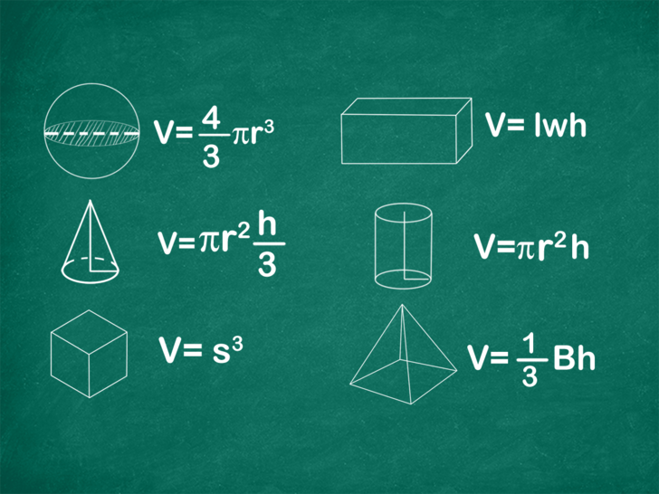
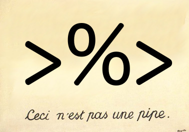

## ¿Qué aprendimos la clase pasada?
* Se aprendió a usar el operador pipe %>%
* Se mostró el concepto de hacer joins entre tablas
* Lectura de datos en R (excel)
* Breve introdución a los datos faltantes

## Funciones en R

Las funciones permiten la automatización de tareas. La escritura de funciones tiene tres grandes ventajas:

* Puedes nombrar una función de una manera tal que nunca olvides qué hace, esto además hace a tu código más legible
* Cuando cambien los requerimientos de los trabajos día a día, deberás de modificar menos código.
* Se reduce la probabilidad de cometer errores llevando a cabo procesos manuales como copiar/pegar datos e instrucciones.

Aprender a escrbir buenas funciones es un proceso que nunca termina. Siempre se encontrarán maneras novedosas de mejorar estilos a la hora de escribir funciones. Esta sección no tiene como objetivo profundizar en la escritura de funciones, si no empezar a escribir funciones útiles lo más pronto posible. 

### ¿Cuándo es conveniente escribir funciones?

Como regla general, si notamos que para llevar a cabo una cierta tarea se está copiando y pegando un bloque de código más de dos veces, es hora de escribir una función para ello. Motivaremos la discusión con el cálculo de areas y volúmenes. Si escribimos una función en R que permita llevar a cabo estas operaciones, las podremos usar en cualquier momento.




### Escribiendo funciones en R

Pasos para crear una función:

* Elegir un nombre apropiado
* Pensar en qué hace y cuántos argumentos necesita para ejecutarse
* Traducir lo que queremos que haga a código de R dentro de un bloque asociado a una función y a los argumentos anteriores

Pensando en estos pasos decidamos que nuestra función se llame area_circulo() (sin acento, es en general, mala práctica utilizar caractéres especiales en código). Luego sabemos que la función recibe un único parámetro, el radio del círculo al que se le va a calcular el área. Finalmente se debe plasmar la fórmula para el cálculo del área de un círculo en R.

Como un primer ejemplo escribamos una función que permita calcular el área de un círculo.

```{r}

# nombre ------------- argumentos
area_circulo <- function (radio) {
  if (radio < 0) # expresión condicional se ejecuta en caso de que el radio sea negativo.
  {
    stop("Para calcular un area es necesario un valor positivo o igual a 0.") # detiene la ejecución
  } else # sigue la expresión condicional, este bloque se ejecutará cuando el radio sea positivo.
  {
    area_calculada <- pi * radio ** 2 # operamos sobre el radio del círculo
    return(area_calculada) # regresamos el resultado (se asigna después de aplicar esta función)
  }
  
}
```

Para probar la función la llamamos como cualquier función de una libreria, notemos que es posible asignar el resultado a una variable:

```{r}
area_radio_cinco <- area_circulo(5)
area_radio_cinco
```


 Ejercicio 1: Escribir una función análoga a la anterior pero para calcular el área de un rectángulo.

 Ejercicio 2: ¿Como podría usar la función del ejercicio 1 para calcular el area de un cuadrado?

### Expresiones condicionales

En ocasiones es deseable ejecutar bloques de código únicamente cuando cierta condición se cumple. Existe una sentencia que nos permite hacer esto y tiene la forma siguiente:

```{r eval=FALSE}
if (cond) {
  # código ejecutado en caso de que la condición sea verdadera (TRUE).
} else {
  # código ejecutado en caso de que la condición sea falsa (FALSE).
}
```
Es posible omitir la segunda condición:

```{r eval=FALSE}
if (cond) {
  # si la condición es verdadera se ejecutará este bloque, en caso contrario no hará nada.
}
```

También es posible encadenar sentencias condicionales:

```{r eval=FALSE}
if (cond_1) {
  # código ejecutado en caso de que la condición 1 sea verdadera.
} else if (cond_2) {
  # código ejecutado en caso de que la condición 1 sea falsa pero la condición 2 es verdadera.
} else {
  # cuando ambas condiciones son falsas se ejecuta este bloque.
}
```

Regresando a nuestra función *area_circulo*, notemos que nuestra formulación tiene un problema. ¿Qué pasa cuando la función recibe números negativos? ¿Tiene sentido hablar de areas negativas? Usaremos las sentencias condicionales para arreglar este detalle:

```{r}

# nombre ------------- argumentos
area_circulo <- function (radio) {
  if (radio < 0) # expresión condicional se ejecuta en caso de que el radio sea negativo.
  {
    stop("Para calcular un area es necesario un valor positivo o igual a 0.") # detiene la ejecución
  } else # sigue la expresión condicional, este bloque se ejecutará cuando el radio sea positivo.
  {
    area_calculada <- pi * radio^2 # operamos sobre el radio del círculo
    return(area_calculada) # regresamos el resultado (se asigna después de aplicar esta función)
  }
  
}
```

Probemos nuestra función mejorada con ambos tipos de valores. ¿Qué pasa cuando la usamos con un número negativo?

```{r eval=FALSE}
# probemos nuestra función en
area_resultante <- area_circulo(-10)
```


```{r}
# probemos nuestra función en
area_resultante <- area_circulo(7)
```

 Ejercicio 3: reescribir la función que calcula el área de un rectángulo para solventar el error permitir parámetros negativos.


 Ejercicio 4: Escribir una función llamada salario que reciba un número que representara el salario de un empleado. Si el salario es mayor a 25,000 deberá regresar el texto "alto", si el salario es menor a 5000 regresará "bajo", en otro caso regresará "medio". Si recibe un salario negativo la función debera detenerse y lanzar un mensaje de error.

### De regreso al tidyverse



Para conectar con lo visto en clases pasadas veremos que es posible encadenar nuestras funciones con el método de los pipes. Para ejemplificar esto regresaremos a nuestro objetivo inicial, el cálculo de volúmenes. Recordemos que los volúmenes de figuras regulares se pueden calcular multiplicando el area de la base del objeto por su altura, nuestra función queda definida de la siguiente forma:


```{r}

volumen_regular <- function (area_base, altura) {
  if (area_base < 0 || altura < 0) { # nos aseguramos que ninguno de los argumentos sea negativo.
    stop("Tanto el area como la altura deben ser mayores o iguales a 0.")
  } else {
    volumen <- area_base * altura
    return(volumen)
  }
}

```

Podemos calcular el volumen de un cilindro de area 3 y altura 7 de la siguiente forma:

```{r}
# definimos las dimensiones
radio <- 3
altura <- 7
# calculamos área y volumen 
area_base <- area_circulo(radio)
volumen_cilindro <- volumen_regular(area_base, altura)
#imprimimos el resultado
volumen_cilindro
```

En una sola sentencia:

```{r}
volumen_cilindro <- volumen_regular(area_circulo(3), 7)
#imprimimos el resultado
volumen_cilindro
```

Sin embargo nada impide hacer el uso del flujo que implementan los pipes. De este modo es posible hacer que el código sea más legible al encadenar las operaciones de izquierda a derecha en vez de adentro hacia afuera:

```{r}
library(tidyverse)
volumen_cilindro <- 3 %>%
                      area_circulo %>%
                      volumen_regular(7)
volumen_cilindro
```

Nota: Recordemos que al usar los pipes, el resulado de una función en la cadena será el argumento de la siguiente. En caso de que la siguiente función requiera más de un argumento el resultado de la función se usará como el primer argumento y resto se tienen que especificar explícitamente.

 Ejercicio 5: Reusa este procedimiento para calcular el volumen de un cubo de lado 6 y un paralelepípedo de dimensiones 4, 5 y 7.

### Ambientes

Otro componente de las funciones es el ambiente. Hasta ahora no ha sido mencionado porque hemos sido muy correctos en la definición de nuestras funciones. Cada variable dentro de la función ha sido pasada como un argumento o bien definida dentro de la función. ¿Qué pasaria si usaramos una variable que no ha sido definida dentro del cuerpo de la función ni ha sido pasada como argumento? Resulta que R es laxo con este tipo de situaciones y lo que hace es buscar si la variable ha sido definida en el contexto en el que se definió la función:

```{r}

y <- 19

suma_incorrecta <- function(x) {
  return(x + y)
}

suma_incorrecta(6)
```

Esto no es recomendable ya que el valor de *y* puede perderse cuando se vuelva a reiniciar RStudio. Este tipo de código puede introducir errores difíciles de rastrear.

### Estilos de código y buenas prácticas

Existen diversos estilos de programación, especialmente en R. Ninguno de estos estilos es correcto, pero la consistencia permite que leer y mantener el código sea más sencillo. Para nombrar variables y funciones existen varias convenciones:

```
este_se_llama_snake_case
losProgramadoresSuelenUsarSnakeCase
a.mi.no.me.gusta.usar.puntos
Some.menJust_WantTO.Watch.theWorld_BURN
```
Como han podido darse cuenta nosotros usamos snake case.

Cuando los statements condicionales son de una sola sentencia es posible no usar las llaves { }. Sin embargo esto reduce la legilibidad del código.

```{r eval=FALSE}
# BIEN las llaves permiten identificar que el código será ejecutado cuando la condición se cumple
muestra_mensaje <- TRUE
if (y < 0 && muestra_mensaje) {
  message("y es negativo")
}

# MAL no hay jerarquía visual
muestra_mensaje <- TRUE
if (y < 0 && muestra_mensaje)
message("y es negativo")

```

Ahora que saben que se puede hacer... ¡No lo hagan!

La elección de nombres es un tema importante a considerar. El código es un vínculo entre las instrucciones que una computadora puede ejecutar y la forma en la que nosotros resolvemos un problema. El lenguaje de programación nos permite expresar la serie de pasos necesarios para llegar a una solución. Por esto el lenguaje debe no solo ejecutarse correctamente sino también legible para el ojo humano. Los nombres en las variables nos pueden ayudar a esto. Revisemos los nombres de nuestras funciones de área:

```{r eval=FALSE}
# BIEN la ayuda de r aparece cuando escribo area y me permite recordar que nombre asigné a cada función
area_circulo(4)
area_cuadrado(3)
area_rectangulo(5,6)

# MAL
circulo_area(4) # el elemento en comun de las funciones no está al principio, dificulta la búsqueda
calcula_area_cuadrado(3) # nomrbe demasiado largo, el verbo sobra porque está implícito
mi_funcion(5,6) # todo mal, ¡no tenemos idea que hace la función!
```

Repitiendo lo que se menciona al principio de la sección no hay una forma correcta de escribir código (existen muchas incorrectas), pero lo más importante es __ser consistente__.

### Temas avanzados de funciones (OPCIONAL)

Esta sección solo es demostrativa de las cosas que permite el lenguaje R sobre las funciones. Se mencionan para hacer más amplio el repertorio en caso de que alguien se interese en indagar más al respecto.

#### Funciones recursivas

## *Las funciones pueden llamarse a si mismas.*


¿Para que querríamos algo así? Las funciones recursivas permiten calcular problemas cuya repesentación se puede formular en terminos de si mismas. El ejemplo por exelencia es la operación factorial:

$$
n!=n\times(n-1)\times(n-2)\times\ldots\times2\times1
$$

Notemos que:

$$
n!=n\times(n-1)!
$$
Y a su vez es:

$$
n!=n\times(n-1)\times(n-2)!
$$

Y sí sucesivamente hasta que llegamos hasta el $1$.

Por lo que podemos definir una función que calcule dicha operación haciendo uso de la misma definición:

```{r}
factorial <- function (n) {
  if(n == 1) {
    return(1) # caso base, no hace falta calcular más
  } else{
    return(n * factorial(n - 1)) # multiplico el número actual y calculo el factorial del número menos una unidad
  }
}

factorial(5)
```

#### Funciones de orden alto

## *Las funciones pueden regresar funciones*:


R es un lenguaje en el que las funciones son objetos que se pueden operar como los números, las cadenas de texto, los data frames.

Con lo que hemos aprendido es posible crear una funcion que permita calcular el cuadrado de un número con ayuda del operador **:

```{r}
cuadrado <- function (x) {
  return(x ** 2)
}

cuadrado(4)
```

De la misma forma podemos obtener una función que calcule el cubo de un número:

```{r}
cubo <- function (x) {
  return(x ** 3)
}

cubo(4)
```

Pero la estructura es básicamente la misma. ¿Es indispensable repetir el mismo código cuando el patrón es tan claro? Resulta que R nos permite hacer plantillas para este tipo de casos:

```{r}
fabrica_potencia <- function (n) {
  function(x) {
    return(x ** n)
  }
}
```

Probemos el resultado:

```{r}
cuadrado <- fabrica_potencia(2)
cuadrado(4)
```

```{r}
cubo <- fabrica_potencia(3)
cubo(4)
```

```{r}
potencia_doce <- fabrica_potencia(12)
potencia_doce(4)
```

